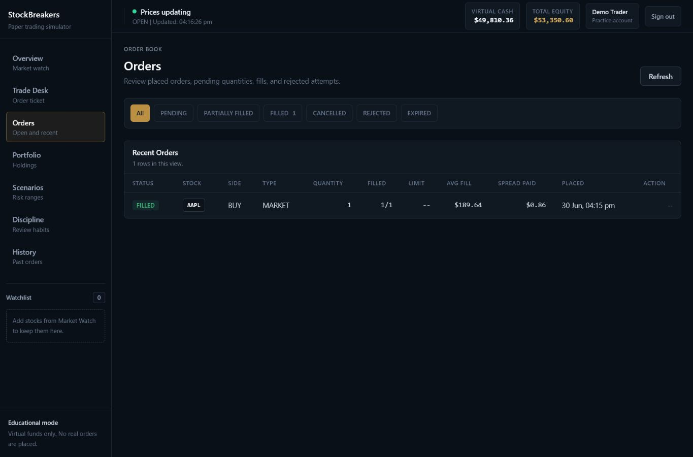
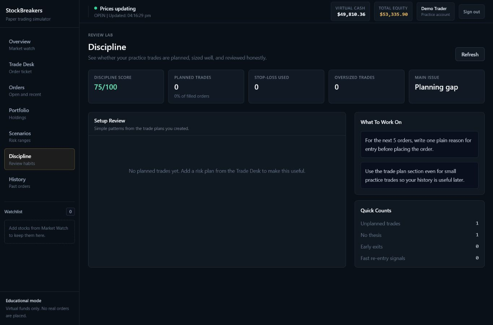
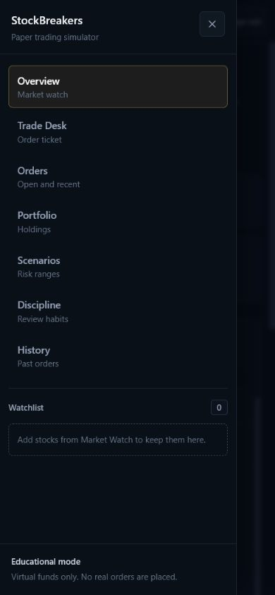

# StockBreakers

StockBreakers is a risk-first paper-trading simulator. It combines a clean React workspace, authenticated portfolio accounting, real-time practice prices, market and limit orders, pending order handling, virtual fills, trade history, scenario analysis, and discipline review.

> Educational paper-trading app only. StockBreakers does not provide financial advice and does not execute real trades.

[Live Demo](https://drawmebaaz.github.io/STOCK_BREAKERS/)

## Demo Access

The hosted demo uses browser-stored sample data so it can run permanently on GitHub Pages without exposing database credentials.

Docker app:

```text
http://localhost:3000
```

Demo login:

```text
Email:    demo@stockbreakers.local
Password: DemoPass123!
```

Seed the demo account after the Docker stack is healthy:

```bash
docker compose exec server npm run seed:demo
```

Full app deployment:

[Render free deployment guide](deploy/RENDER_FREE.md)

## What It Does

- Keeps each user account separate with its own virtual cash, watchlist, holdings, orders, and history.
- Streams simulated market quotes with bid, ask, spread, volume, day range, and rolling candle history.
- Supports market and limit orders with filled, pending, partially filled, cancelled, rejected, and expired states.
- Records executed fills separately from orders so pending and cancelled orders are not mixed with completed trades.
- Helps users plan trades with thesis, stop-loss, target, confidence, and position-size checks.
- Shows portfolio analytics such as closed gain/loss, open gain/loss, win rate, drawdown, concentration, and open planned risk.
- Frames analytics as scenario analysis using simulated in-app history, not real-market prediction.
- Adds a discipline page that highlights planning gaps, missing stop-losses, oversized trades, and review habits.

## Core Features

Trading workspace:

- Real-time simulated market prices over Socket.IO
- Market watch with searchable stocks and watchlist controls
- Market and limit order ticket
- Bid/ask, spread, estimated slippage, cash-after-order, and position-after-order visibility
- Stop-loss, target, thesis, confidence, setup type, and invalidation notes
- Position-size warning based on per-user risk settings
- Pending order result and cancel flow

Portfolio and history:

- Total equity, virtual cash, market value, and open gain/loss
- Holdings table with average cost, live value, and return %
- Allocation chart and holdings breakdown
- Closed gain/loss, win rate, drawdown, open planned risk, and exposure warnings
- Trade history with fill price, slippage, closed gain/loss, position-after-trade, and order IDs
- Separate Orders page for pending, filled, cancelled, rejected, and partially filled orders

Scenario and review:

- Backend-maintained rolling price history per stock
- Scenario range with lower, middle, and upper cases
- Risk level and plain-language notes about recent price behavior
- Stock ideas with short reasons for practice decisions
- Graceful fallback when the FastAPI scenario service is slow or unavailable
- Discipline page with score, biggest issue, setup review, and recommendation cards

## Screenshots

| Portfolio overview | Trade desk |
| --- | --- |
|  |  |

| Holdings | Research settings |
| --- | --- |
|  |  |

| Scenario range | Trade history |
| --- | --- |
|  |  |

| Orders | Discipline review |
| --- | --- |
|  |  |

| Mobile navigation |
| --- |
|  |

## Architecture

```text
Browser
  |-- React + Vite trading workspace
  |-- Zustand state management
  |-- Recharts charts
  |-- Socket.IO client with polling fallback
  v
Express API
  |-- Auth, orders, fills, holdings, transactions, watchlist
  |-- Order engine with bid/ask, slippage, partial fills, and idempotency
  |-- Risk settings, portfolio analytics, and discipline summary
  |-- Backend rolling quote and candle history
  |-- Zod validation and security middleware
  |-- MongoDB persistence
  v
FastAPI Scenario Service
  |-- Simulated scenario range generation
  |-- Risk level calculation
  |-- Practice stock ideas
```

## Tech Stack

- Frontend: React 18, Vite 8, Tailwind CSS, Zustand, Recharts, Lucide
- Backend: Node.js 20+, Express, MongoDB, Mongoose, JWT, Socket.IO, Zod
- Research service: FastAPI, Pydantic 2, NumPy, Uvicorn
- Runtime/deploy: Docker Compose, Nginx, Render blueprint, GitHub Pages demo, health checks, readiness checks

## Scenario Flow

StockBreakers keeps the scenario flow transparent:

1. The backend price engine maintains rolling simulated price history for every stock.
2. The Scenario screen requests that history through the backend.
3. The Express API forwards the request to the FastAPI scenario service with a strict timeout.
4. The scenario service returns a range, risk level, and practice stock ideas.
5. If the service is down or slow, Express returns a simpler backend-only fallback instead of leaving the UI stuck.

The user sees:

- Current price
- Lower, middle, and upper cases
- Upside cases
- Risk level
- Plain-language notes about what to watch

## Docker Compose

Create a root `.env` from `.env.example` and set a strong `JWT_SECRET`:

```bash
cp .env.example .env
docker compose up --build
```

Docker URLs:

```text
Client: http://localhost:3000
API:    http://localhost:5000/api/health
Research service: http://localhost:8000/health
```

Seed the demo user:

```bash
docker compose exec server npm run seed:demo
```

## Local Development

Start MongoDB locally, then create environment files:

```bash
cp server/.env.example server/.env
cp client/.env.example client/.env
cp ml-service/.env.example ml-service/.env
```

Run services in separate terminals:

```bash
cd ml-service
pip install -r requirements.txt
uvicorn main:app --reload --port 8000
```

```bash
cd server
npm install
npm run dev
```

```bash
cd client
npm install
npm run dev
```

Local dev URLs:

```text
Client:     http://localhost:5173
API:        http://localhost:5000/api/health
API ready:  http://localhost:5000/api/ready
Research docs: http://localhost:8000/docs
```

## Environment Variables

Backend:

```text
NODE_ENV=production
PORT=5000
MONGO_URI=mongodb://localhost:27017/stockbreakers
JWT_SECRET=replace-with-a-64-character-random-secret
JWT_EXPIRES_IN=7d
ML_SERVICE_URL=http://localhost:8000
CLIENT_URL=http://localhost:5173
CORS_ORIGINS=http://localhost:5173
RATE_LIMIT_WINDOW_MS=900000
RATE_LIMIT_MAX=250
TRUST_PROXY=false
STATIC_DIR=
MARKET_SESSION_ENABLED=true
```

Frontend:

```text
VITE_API_URL=http://localhost:5000/api
VITE_SOCKET_URL=http://localhost:5000
VITE_DEMO_MODE=false
VITE_BASE_PATH=/
```

Research service:

```text
CORS_ORIGINS=http://localhost:5173,http://localhost:5000
```

## API Surface

Auth:

- `POST /api/auth/register`
- `POST /api/auth/login`
- `GET /api/auth/me`

Market and portfolio:

- `GET /api/stocks`
- `GET /api/stocks/:ticker`
- `GET /api/market/status`
- `GET /api/market/candles/:ticker`
- `POST /api/orders`
- `GET /api/orders`
- `GET /api/orders/:id`
- `POST /api/orders/:id/cancel`
- `POST /api/trade/buy`
- `POST /api/trade/sell`
- `GET /api/portfolio`
- `GET /api/portfolio/summary`
- `GET /api/portfolio/analytics`
- `GET /api/transactions?limit=50`
- `POST /api/watchlist/add`
- `POST /api/watchlist/remove`
- `GET /api/risk/settings`
- `PUT /api/risk/settings`
- `GET /api/discipline/summary`
- `GET /api/trade-plans`
- `GET /api/trade-plans/:id`
- `POST /api/trade-plans`
- `PATCH /api/trade-plans/:id`
- `POST /api/trade-plans/:id/review`

Scenario:

- `GET /api/ai/history/:ticker`
- `POST /api/ai/scenario`
- `POST /api/ai/predict`
- `POST /api/ai/sentiment`
- `POST /api/ai/risk`
- `GET /api/ai/suggestions`

Ops:

- `GET /api/health`
- `GET /api/ready`
- `GET /health` on the research service
- `GET /ready` on the research service

## Quality Checks

```bash
cd client
npm run build
```

```bash
cd client
VITE_DEMO_MODE=true VITE_BASE_PATH=/STOCK_BREAKERS/ npm run build
```

```bash
cd server
npm test
```

```bash
cd server
npm run audit:prod
```

```bash
cd ml-service
python -m compileall main.py
```

## Known Limitations

- Market data is simulated inside the app.
- Orders are simulated and never sent to a real broker.
- The fill model is simplified compared with real exchanges.
- Average-cost accounting is used instead of detailed tax lots.
- Scenario analysis is based on simulated in-app history and should not be treated as investment advice.
- Local MongoDB standalone mode uses safe sequential writes; a production replica set is required for true multi-document transactions.
