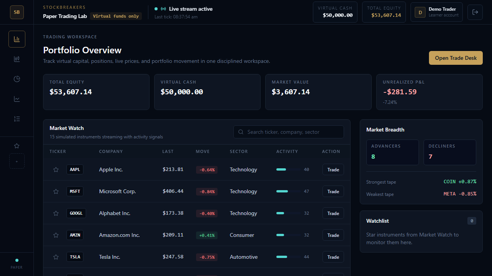
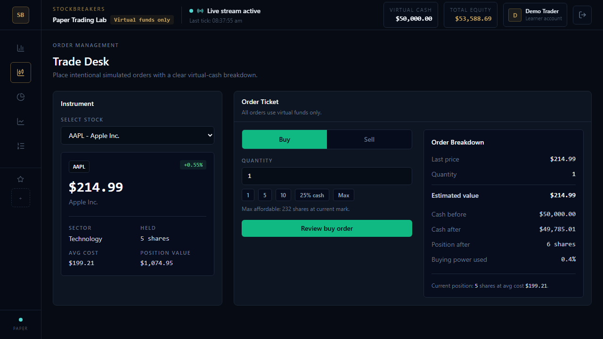
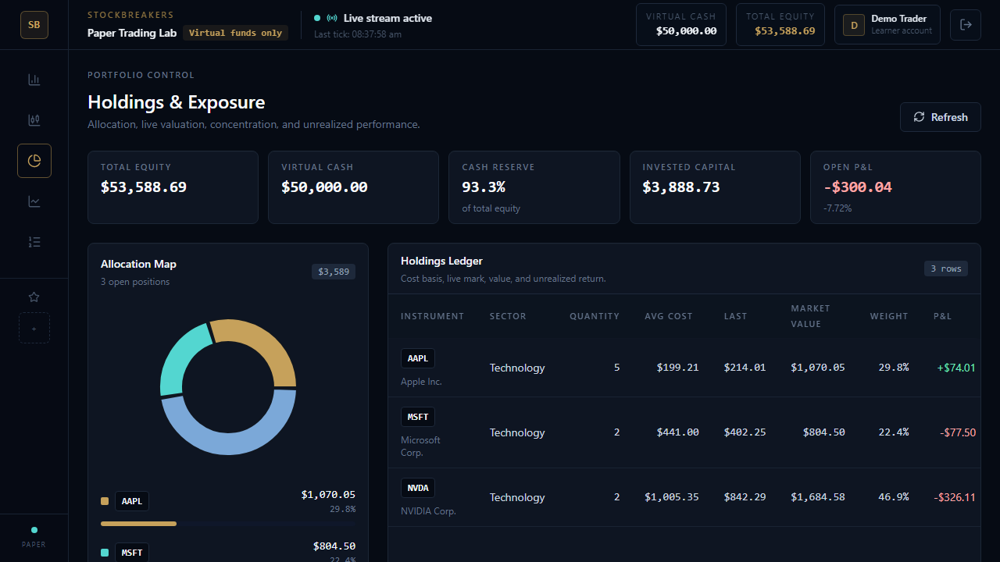
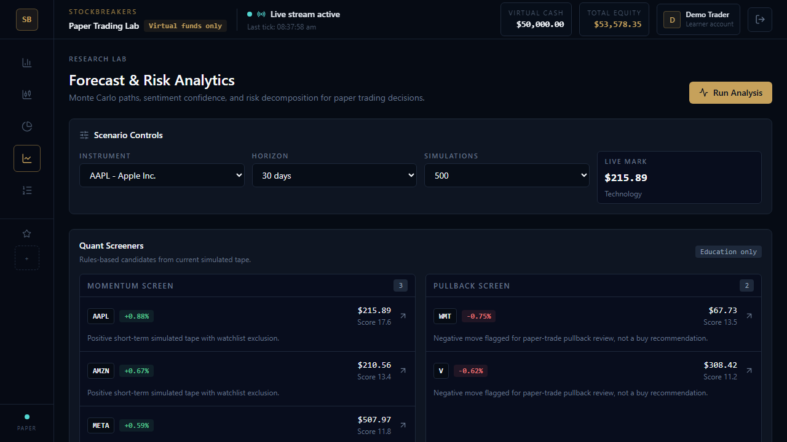
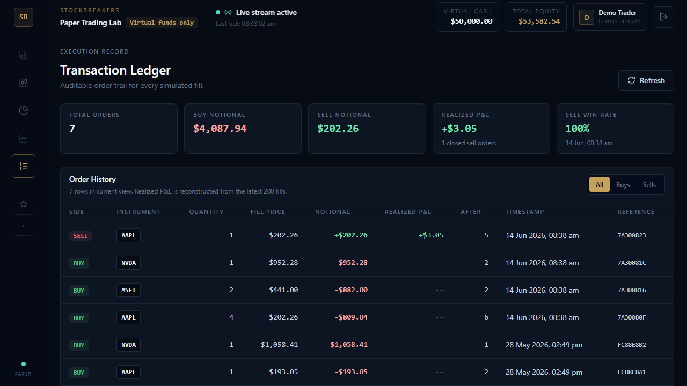

# StockBreakers

StockBreakers is a production-minded paper-trading simulator. It combines a clean React workspace, authenticated portfolio accounting, real-time practice prices, virtual buy/sell flows, trade history, and a simple research screen for comparing possible price ranges before a practice trade.

> Educational paper-trading app only. StockBreakers does not provide financial advice and does not execute real trades.

[Live Demo](https://drawmebaaz.github.io/STOCK_BREAKERS/)

## Demo Access

The hosted demo uses browser-stored sample data so it can run permanently on GitHub Pages without exposing database credentials.

Docker app:

```text
http://localhost:3000
```

Demo login:

```text
Email:    demo@stockbreakers.local
Password: DemoPass123!
```

Seed the demo account after the Docker stack is healthy:

```bash
docker compose exec server npm run seed:demo
```

Full app deployment:

[Render free deployment guide](deploy/RENDER_FREE.md)

## Why This Project Stands Out

- Full-stack trading simulator with real authentication, portfolio state, watchlists, trade flow, and trade history.
- Microservice architecture using React, Express/MongoDB, Socket.IO, FastAPI/NumPy, and Docker Compose.
- Backend-owned rolling price history keeps the research screen consistent across refreshes and devices.
- Research screen gives a simple forecast range, risk level, plain-language notes, and stock ideas without overloading users with acronyms.
- Secure, intentional trading UX with trade review, max affordable/sellable quantity, cash usage, stale-price protection, and virtual-funds clarity.
- Production hardening includes JWT auth, Zod validation, Helmet, CORS configuration, rate limiting, health/readiness probes, Dockerized services, and Nginx frontend hosting.

## Core Features

Trading workspace:

- Real-time simulated market prices over Socket.IO
- Market watch with searchable stocks and watchlist controls
- Buy/sell trade ticket with validation and confirmation flow
- Virtual cash accounting and position-after-order visibility
- Stale-price guard before confirming reviewed trades

Portfolio and history:

- Total equity, virtual cash, market value, and open gain/loss
- Holdings table with average cost, live value, and return %
- Allocation chart and holdings breakdown
- Trade history with buy/sell value, closed gain/loss, sell win rate, position-after-trade, and trade IDs

Research screen:

- Backend-maintained rolling price history per stock
- Simple forecast range with low, middle, and high estimates
- Risk level and plain-language notes about recent price behavior
- Stock ideas with short reasons for practice decisions

## Screenshots

| Portfolio overview | Trade desk |
| --- | --- |
|  |  |

| Holdings | Research settings |
| --- | --- |
|  |  |

| Forecast range | Trade history |
| --- | --- |
|  |  |

## Development Write-Up

I documented the major problems faced while building StockBreakers and how each one was solved:

[Building StockBreakers: Problems Faced and How I Solved Them](docs/development-problems-and-solutions.md)

## Architecture

```text
Browser
  |-- React + Vite trading workspace
  |-- Zustand state management
  |-- Recharts charts
  |-- Socket.IO client for live prices
  v
Express API
  |-- Auth, trades, holdings, transactions, watchlist
  |-- Backend rolling price history
  |-- Zod validation and security middleware
  |-- MongoDB persistence
  v
FastAPI Research Service
  |-- Forecast range generation
  |-- Risk level calculation
  |-- Practice stock ideas
```

## Tech Stack

- Frontend: React 18, Vite 8, Tailwind CSS, Zustand, Recharts, Lucide
- Backend: Node.js 20+, Express, MongoDB, Mongoose, JWT, Socket.IO, Zod
- Research service: FastAPI, Pydantic 2, NumPy, Uvicorn
- Runtime/deploy: Docker Compose, Nginx, Render blueprint, GitHub Pages demo, health checks, readiness checks

## Research Flow

StockBreakers keeps the research flow transparent and easy to explain:

1. The backend price engine maintains rolling simulated price history for every stock.
2. The Research screen requests that history through the backend.
3. The Express API forwards the request to the FastAPI research service.
4. The research service returns a simple price range, risk level, and practice stock ideas.
5. The frontend explains the result in user-friendly language instead of exposing backend internals.

The user sees:

- Current price
- Low, middle, and high estimate
- Chance above today's price
- Risk level
- Plain-language notes about what to watch

## Docker Compose

Create a root `.env` from `.env.example` and set a strong `JWT_SECRET`:

```bash
cp .env.example .env
docker compose up --build
```

Docker URLs:

```text
Client: http://localhost:3000
API:    http://localhost:5000/api/health
Research service: http://localhost:8000/health
```

Seed the demo user:

```bash
docker compose exec server npm run seed:demo
```

## Local Development

Start MongoDB locally, then create environment files:

```bash
cp server/.env.example server/.env
cp client/.env.example client/.env
cp ml-service/.env.example ml-service/.env
```

Run services in separate terminals:

```bash
cd ml-service
pip install -r requirements.txt
uvicorn main:app --reload --port 8000
```

```bash
cd server
npm install
npm run dev
```

```bash
cd client
npm install
npm run dev
```

Local dev URLs:

```text
Client:     http://localhost:5173
API:        http://localhost:5000/api/health
API ready:  http://localhost:5000/api/ready
Research docs: http://localhost:8000/docs
```

## Environment Variables

Backend:

```text
NODE_ENV=production
PORT=5000
MONGO_URI=mongodb://localhost:27017/stockbreakers
JWT_SECRET=replace-with-a-64-character-random-secret
JWT_EXPIRES_IN=7d
ML_SERVICE_URL=http://localhost:8000
CLIENT_URL=http://localhost:5173
CORS_ORIGINS=http://localhost:5173
RATE_LIMIT_WINDOW_MS=900000
RATE_LIMIT_MAX=250
TRUST_PROXY=false
STATIC_DIR=
```

Frontend:

```text
VITE_API_URL=http://localhost:5000/api
VITE_SOCKET_URL=http://localhost:5000
VITE_DEMO_MODE=false
VITE_BASE_PATH=/
```

Research service:

```text
CORS_ORIGINS=http://localhost:5173,http://localhost:5000
```

## API Surface

Auth:

- `POST /api/auth/register`
- `POST /api/auth/login`
- `GET /api/auth/me`

Market and portfolio:

- `GET /api/stocks`
- `GET /api/stocks/:ticker`
- `POST /api/trade/buy`
- `POST /api/trade/sell`
- `GET /api/portfolio`
- `GET /api/portfolio/summary`
- `GET /api/transactions?limit=50`
- `POST /api/watchlist/add`
- `POST /api/watchlist/remove`

Research:

- `GET /api/ai/history/:ticker`
- `POST /api/ai/predict`
- `POST /api/ai/sentiment`
- `POST /api/ai/risk`
- `GET /api/ai/suggestions`

Ops:

- `GET /api/health`
- `GET /api/ready`
- `GET /health` on the research service
- `GET /ready` on the research service

## Quality Checks

```bash
cd client
npm run build
```

```bash
cd client
VITE_DEMO_MODE=true VITE_BASE_PATH=/STOCK_BREAKERS/ npm run build
```

```bash
cd server
npm run audit:prod
```

```bash
cd ml-service
python -m compileall main.py
```
